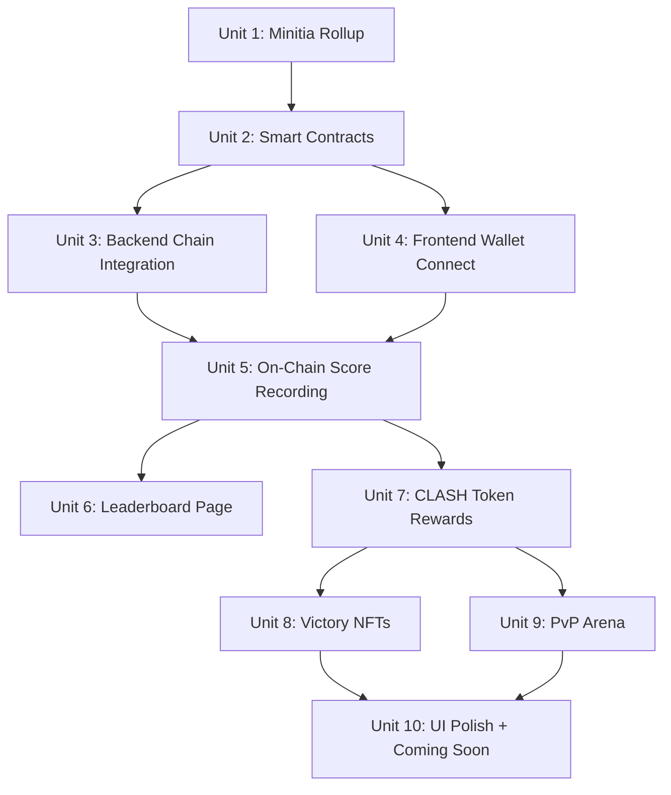

# Initia Blockchain Integration

## Overview

Add blockchain integration to Clash of Prompt by deploying a **Move VM Minitia** rollup on Initia testnet (Gaming track requirement). Move modules handle leaderboard scoring, CLASH token (fungible_asset), Victory NFT minting, and async PvP wager settlement. Frontend uses **InterwovenKit** for wallet connection and **auto-signing** for seamless gameplay (no popup per transaction). Backend records battle results on-chain after each victory.

**PIVOTED from EVM to Move VM** — Gaming track requires Move. Added auto-signing as mandatory native feature.

## Problem Frame

The game works as a web app but has no blockchain integration. The Initia INITIATE hackathon (deadline: April 15, 2026) requires the project to be deployed as its own Minitia rollup with on-chain features. (see origin: `docs/brainstorms/2026-04-03-initia-integration-requirements.md`)

## Requirements Trace

- R1. Deploy Move VM Minitia rollup on Initia testnet
- R2. Rollup accessible via Initia RPC + REST
- R2b. Implement auto-signing native feature for seamless UX
- R3. Wallet connect via InterwovenKit (@initia/interwovenkit-react)
- R4. Wallet optional for PvE
- R5. Wallet required for PvP + rewards
- R6. Record battle results on-chain
- R7. Leaderboard reads from smart contract
- R8. Leaderboard ranked by score
- R9. CLASH token (Move fungible_asset) minted on win
- R10. Token reward scales with performance
- R11. CLASH used for PvP wagers
- R12. Victory NFT with on-chain metadata
- R13. NFT includes battle comic image
- R14. PvP lobby with CLASH wager
- R15. Async PvP — both fight same monster, highest score wins
- R16. Winner takes wager minus burn fee
- R17. PvP results on leaderboard with PvP tag

## Scope Boundaries

- Testnet only — no real-money value
- Gas set to 0 on our minitia (we are the operator)
- PvP is async only
- Desktop MetaMask only
- No bridging to Initia L1
- Co-op and Direct PvP shown as "Coming Soon" in UI only

## Context & Research

### Relevant Code and Patterns

- `src/app/page.tsx` — game state machine (phase: title → select → battle → end)
- `src/components/BattleEndScreen.tsx` — victory/defeat result screen, receives score/turns/enemyName
- `backend/lib/game-engine.ts` — `processTurn()`, `calculateScore()`, `getBattleSummary()`
- `backend/server.ts` — all API routes, in-memory battle store
- `src/app/api/` — thin proxy routes to backend

### Initia / Move Minitia

- **Weave CLI** v0.3.9 deploys Move minitia with `weave rollup launch --vm move`
- Move modules deployed via `initiad move publish`
- Initia uses Aptos-dialect Move with `initia_std` stdlib
- Token standard: `initia_std::fungible_asset` (equivalent to ERC-20)
- NFT: `initia_std::nft` or custom collection module
- **Auto-signing**: Required native feature — enables session-based signing so players don't get MetaMask popups every turn
- **InterwovenKit**: Required frontend SDK for wallet connection (`@initia/interwovenkit-react`)
- **Agent skills**: `npx skills add initia-labs/agent-skills` for hackathon tooling
- Gas pricing controlled by operator — set to 0 for hackathon

### External References

- [Initia Deploy Docs](https://docs.initia.xyz/nodes-and-rollups/deploying-rollups/deploy)
- [Initia Hackathon Get Started](https://docs.initia.xyz/hackathon/get-started)
- [Initia Hackathon Builder Guide](https://docs.initia.xyz/hackathon/builder-guide)
- [Weave CLI GitHub](https://github.com/initia-labs/weave)
- [Initia Move GitHub](https://github.com/initia-labs/move)
- [BlockForge Game Blueprint](https://docs.initia.xyz/hackathon/builder-guide) — reference for auto-signing

## Key Technical Decisions

- **3 Move modules**: `clash_token` (fungible_asset), `victory_nft` (collection + token), `game_arena` (leaderboard + PvP). Separated for clarity and reuse.
- **Move VM over EVM**: Gaming track requires Move. Using Aptos-dialect Move with `initia_std`.
- **Auto-signing**: Required native feature. Enables session-based signing — players approve once, then all in-game transactions (score recording, token minting) happen without popups. Critical for gameplay UX.
- **InterwovenKit**: Required frontend SDK. Replaces raw ethers.js/MetaMask.
- **Backend calls modules**: The backend (not frontend) records scores and mints tokens/NFTs after battle ends via `initiad tx move execute`. This prevents cheating.
- **Frontend reads modules**: Leaderboard and NFT gallery read via Initia REST API — no backend needed for reads.
- **NFT image as URL**: Victory NFT metadata points to a backend URL that serves the battle comic image.
- **PvP via game_arena module**: Lobby creation, wager locking, and settlement handled on-chain.
- **Zero gas**: Our minitia sets gas to 0.

## Open Questions

### Resolved During Planning

- **Gas cost for players?** → Zero. We set gas to 0 on our minitia.
- **NFT image storage?** → URL to backend endpoint serving the comic image.
- **PvP fairness?** → Both players fight identical enemy (same ID, HP, stats). AI evaluates independently. Final score comparison is deterministic per game rules.
- **Who calls contracts?** → Backend for writes (prevents cheating). Frontend for reads (verifiable).

### Deferred to Implementation

- Exact weave CLI config values (chain-id, genesis accounts) — determined during setup
- Whether to run minitia locally during dev or use a persistent testnet instance

## High-Level Technical Design

> *This illustrates the intended approach and is directional guidance for review, not implementation specification.*

```
┌─────────────────────────────────────────────────────────┐
│                    SMART CONTRACTS                       │
│                                                         │
│  clash_token (Move fungible_asset)                      │
│  ├── mint(to, amount)           [only admin]            │
│  └── burn(amount)                                       │
│                                                         │
│  victory_nft (Move collection + token)                  │
│  ├── mint(to, metadata)         [only admin]            │
│  └── get_metadata(token_id) → attributes               │
│                                                         │
│  game_arena (Move module)                               │
│  ├── record_score(player, enemy, score, turns, creativity)│
│  ├── get_leaderboard(limit) → top scores                │
│  ├── create_pvp_lobby(enemy_id, wager)                  │
│  ├── join_pvp_lobby(lobby_id)                           │
│  ├── submit_pvp_result(lobby_id, player, score)         │
│  └── settle_pvp(lobby_id)                               │
└────────────────────┬────────────────────────────────────┘
                     │
        ┌────────────┼────────────────┐
        │            │                │
   ┌────▼────┐  ┌────▼────┐    ┌─────▼─────┐
   │ Backend │  │Frontend │    │  MetaMask  │
   │(Fly.io) │  │(Vercel) │    │  (Player)  │
   ├─────────┤  ├─────────┤    └─────┬─────┘
   │ Battle  │  │ Leader- │          │
   │ engine  │  │ board   │     Connect +
   │ Claude  │  │ NFT     │     Approve txs
   │ Gemini  │  │ gallery │     (PvP wager)
   │         │  │ PvP UI  │
   │ On win: │  │         │
   │ → record│  │ Reads   │
   │   score │  │ from    │
   │ → mint  │  │ contract│
   │   token │  │ directly│
   │ → mint  │  │         │
   │   NFT   │  │         │
   └─────────┘  └─────────┘
```

## Implementation Units



---

- [ ] **Unit 1: Deploy EVM Minitia Rollup**

**Goal:** Get a running Move VM minitia with RPC/REST endpoints + auto-signing support

**Requirements:** R1, R2, R2b

**Dependencies:** None

**Files:**
- Create: `move/` directory for Move modules
- Create: `move/sources/` directory

**Approach:**
- Install weave CLI + prerequisites (Docker, Go 1.22+, lz4)
- Run `npx skills add initia-labs/agent-skills` for hackathon tooling
- Run `weave rollup launch --vm move` with chain-id and 0 gas
- Add operator account + test accounts to genesis
- Start OPinit executor + IBC relayer via weave
- Record REST and RPC endpoints
- Reference BlockForge Game blueprint for auto-signing setup

**Test expectation:** none — infrastructure setup, not code

**Verification:**
- Minitia rollup is running and accessible
- `initiad query` commands work against the RPC endpoint
- Can deploy a test Move module

---

- [ ] **Unit 2: Smart Contracts**

**Goal:** Write and deploy clash_token, victory_nft, and game_arena Move modules

**Requirements:** R6, R9, R12, R14

**Dependencies:** Unit 1

**Files:**
- Create: `move/sources/clash_token.move`
- Create: `move/sources/victory_nft.move`
- Create: `move/sources/game_arena.move`
- Create: `move/Move.toml`
- Test: `move/sources/game_arena_tests.move`

**Approach:**
- clash_token: Move fungible_asset using `initia_std::fungible_asset`. Admin-only minting. Backend wallet is admin.
- victory_nft: Move collection + token using `initia_std::nft` or `initia_std::collection`. Metadata stored as on-chain attributes (enemy_id, score, turns, avg_creativity, timestamp, image_url).
- game_arena: Leaderboard (vector of ScoreEntry structs, sorted by score). PvP lobby (create, join, submit_result, settle). PvP escrows CLASH tokens via module account.
- Deploy all modules via `initiad move publish`. Backend wallet set as admin.

**Patterns to follow:**
- Initia Move stdlib (`initia_std::fungible_asset`, `initia_std::nft`)
- Aptos Move patterns for resource management and access control

**Test scenarios:**
- Happy path: deploy all modules, verify admin is set
- Happy path: mint CLASH tokens to an address, verify balance
- Happy path: mint victory_nft with metadata, verify attributes readable
- Happy path: record score, query leaderboard, verify ranking order
- Happy path: create PvP lobby with wager, join, submit scores, settle — winner gets tokens
- Edge case: non-admin tries to mint tokens → aborts
- Error path: join already-full PvP lobby → aborts
- Error path: settle PvP before both players submit → aborts

**Verification:**
- All contracts deploy successfully to minitia
- Hardhat tests pass

---

- [ ] **Unit 3: Backend Chain Integration**

**Goal:** Backend can call smart contracts after battle ends

**Requirements:** R6, R9, R10, R12, R13

**Dependencies:** Unit 2

**Files:**
- Create: `backend/lib/chain.ts`
- Modify: `backend/server.ts` (add chain calls after battle end)
- Modify: `backend/package.json` (add @initia/initia.js dependency)

**Approach:**
- New `chain.ts` module: use `@initia/initia.js` SDK to call Move module functions via `MsgExecute`
- Initialize with env vars: `MINITIA_LCD_URL`, `BACKEND_MNEMONIC`, `MODULE_ADDRESS`
- Export functions: `recordScore()`, `mintClashToken()`, `mintVictoryNFT()`, `submitPvPResult()`, `settlePvP()`
- In `server.ts`: after `processTurn()` returns a completed battle (victory), call chain functions
- Token reward formula: `baseReward * (creativityAvg / 10) * (1 + (maxTurns - turns) / maxTurns)`
- NFT image_url: `{BACKEND_URL}/api/battle/image/{battleId}`

**Patterns to follow:**
- Existing `backend/lib/gemini.ts` pattern for optional service (chain calls fail gracefully if not configured)

**Test scenarios:**
- Happy path: battle victory triggers recordScore + mintClashToken + mintVictoryNFT
- Happy path: token reward scales — high creativity + few turns = more CLASH
- Edge case: battle defeat → no on-chain recording, no tokens, no NFT
- Error path: chain RPC unreachable → battle still works, chain recording fails silently (logged)
- Integration: full turn cycle ending in victory → verify score on contract

**Verification:**
- After a victory, score appears on-chain
- CLASH tokens in player wallet
- VictoryNFT minted with correct metadata

---

- [ ] **Unit 4: Frontend Wallet Connect**

**Goal:** Players can connect MetaMask to the game

**Requirements:** R3, R4, R5

**Dependencies:** Unit 2 (needs contract addresses and chain ID)

**Files:**
- Create: `src/lib/wallet.ts`
- Create: `src/components/WalletButton.tsx`
- Modify: `src/app/page.tsx` (add wallet state)
- Modify: `src/app/layout.tsx` (wallet provider context)

**Approach:**
- Use InterwovenKit (`@initia/interwovenkit-react`) for wallet connection — required by hackathon
- InterwovenKit wraps Initia wallet + auto-signing session management
- Auto-signing: player approves a session once, then all in-game transactions happen without popups
- WalletButton component: shows "Connect Wallet" or truncated address + CLASH balance
- Wallet state from InterwovenKit context, passed to components
- If no wallet connected, PvE still works but skips on-chain features

**Patterns to follow:**
- Existing `src/components/LanguageSwitcher.tsx` pattern for header UI element
- InterwovenKit docs and BlockForge Game blueprint for auto-signing setup

**Test scenarios:**
- Happy path: click connect → InterwovenKit wallet popup → address shown in header
- Happy path: auto-signing session active → transactions don't trigger popups
- Happy path: disconnect → reverts to "Connect Wallet" button
- Edge case: wallet not installed → show helpful message
- Happy path: wallet connected → CLASH balance shown

**Verification:**
- Wallet address visible in UI after connecting
- Auto-signing session works — score recording happens without popup

---

- [ ] **Unit 5: On-Chain Score Recording**

**Goal:** Battle victories automatically record scores on-chain when wallet is connected

**Requirements:** R6, R4

**Dependencies:** Unit 3, Unit 4

**Files:**
- Modify: `src/components/BattleEndScreen.tsx` (show on-chain status)
- Modify: `src/app/api/battle/turn/route.ts` (pass wallet address to backend)
- Modify: `backend/server.ts` (accept wallet address, call chain on victory)

**Approach:**
- Frontend sends player wallet address with each turn request (if connected)
- Backend stores wallet address in battle state
- On victory: backend calls `chain.recordScore(walletAddress, ...)` and `chain.mintClashToken(walletAddress, ...)`
- BattleEndScreen shows: "Score recorded on-chain ✓" or "Connect wallet to save scores on-chain"

**Patterns to follow:**
- Existing turn submission flow in `BattleScreen.tsx`

**Test scenarios:**
- Happy path: win with wallet → score on-chain, token minted, UI confirms
- Happy path: win without wallet → normal flow, no chain interaction, UI suggests connecting
- Edge case: chain call fails after victory → victory still counts, show "Chain recording failed" warning

**Verification:**
- Score visible on-chain after victory (queryable via ethers.js)
- BattleEndScreen shows chain confirmation

---

- [ ] **Unit 6: Leaderboard Page**

**Goal:** New page showing on-chain leaderboard

**Requirements:** R7, R8

**Dependencies:** Unit 5

**Files:**
- Create: `src/app/leaderboard/page.tsx`
- Modify: `src/app/page.tsx` (add leaderboard link)
- Modify: `src/components/TitleScreen.tsx` (add leaderboard button)
- Modify: `src/components/BattleEndScreen.tsx` (add "View Leaderboard" button)

**Approach:**
- New page reads directly from game_arena module via Initia REST API (no backend needed)
- Shows top 50 scores: rank, address (truncated), enemy, score, turns, creativity, date
- Styled with existing terminal/retro theme
- Link from title screen and battle end screen

**Patterns to follow:**
- Existing component styling in `src/components/TitleScreen.tsx`

**Test scenarios:**
- Happy path: page loads, shows ranked scores from contract
- Edge case: no scores yet → shows empty state message
- Edge case: wallet not connected → leaderboard still readable (public data)

**Verification:**
- Leaderboard shows real scores from contract
- Rankings match expected order

---

- [ ] **Unit 7: CLASH Token Rewards Display**

**Goal:** Show CLASH token balance and reward animation on win

**Requirements:** R9, R10

**Dependencies:** Unit 5

**Files:**
- Modify: `src/components/WalletButton.tsx` (show CLASH balance)
- Modify: `src/components/BattleEndScreen.tsx` (show CLASH earned)

**Approach:**
- WalletButton polls CLASH balance from contract
- BattleEndScreen shows "+X CLASH earned!" with animation after victory
- Reward amount calculated by backend, displayed to player

**Test scenarios:**
- Happy path: win battle → CLASH balance increases, "+X CLASH" shown
- Happy path: balance updates in header after reward
- Edge case: no wallet → no CLASH display

**Verification:**
- CLASH balance shown in header matches on-chain balance
- Reward amount displayed matches formula

---

- [ ] **Unit 8: Victory NFT Minting**

**Goal:** Mint NFT on victory with battle comic and metadata

**Requirements:** R12, R13

**Dependencies:** Unit 5

**Files:**
- Create: `src/app/api/battle/nft/[id]/route.ts` (serve NFT metadata JSON)
- Modify: `src/components/BattleEndScreen.tsx` (show NFT minted confirmation)
- Modify: `backend/server.ts` (add NFT metadata endpoint)

**Approach:**
- Backend mints VictoryNFT with tokenURI pointing to `{BACKEND_URL}/api/nft/{tokenId}`
- NFT metadata endpoint returns standard ERC-721 JSON: name, description, image URL, attributes (enemy, score, turns, creativity)
- Image URL points to battle comic image from that battle
- BattleEndScreen shows "Victory NFT minted! #tokenId"

**Test scenarios:**
- Happy path: win → NFT minted, metadata accessible via tokenURI
- Happy path: NFT metadata includes correct enemy, score, turns, creativity
- Edge case: image generation failed → NFT still mints with placeholder image

**Verification:**
- NFT visible in player wallet
- tokenURI returns valid metadata JSON with image

---

- [ ] **Unit 9: PvP Arena**

**Goal:** Async PvP where two players wager CLASH tokens and compete

**Requirements:** R14, R15, R16, R17

**Dependencies:** Unit 7

**Files:**
- Create: `src/components/PvPLobby.tsx`
- Create: `src/components/PvPBattle.tsx`
- Create: `src/app/api/pvp/route.ts` (proxy to backend PvP endpoints)
- Modify: `backend/server.ts` (add PvP routes: create, join, submit, settle)
- Modify: `src/app/page.tsx` (add PvP phase to state machine)
- Modify: `src/lib/i18n.ts` (PvP translations)

**Approach:**
- PvP flow: Create lobby (choose enemy + wager amount) → Share lobby ID → Opponent joins → Both play same enemy independently → Backend submits both scores → Contract settles winner
- Lobby creation: player approves CLASH token transfer, contract locks wager
- Join: opponent approves + locks matching wager
- Battle: same PvE flow but with lobbyId tracked. Backend submits result to contract after each player finishes.
- Settlement: once both results submitted, contract transfers total wager to winner (minus 5% burn)
- UI: new "PvP Arena" button on title screen → lobby list or create new → share link → battle → results

**Patterns to follow:**
- Existing `EnemySelect.tsx` for lobby UI
- Existing `BattleScreen.tsx` for PvP battle (reuse entirely, just track lobbyId)

**Test scenarios:**
- Happy path: create lobby → join → both battle → winner gets wager
- Happy path: PvP result appears on leaderboard with "PvP" tag
- Edge case: creator cancels before opponent joins → wager refunded
- Edge case: opponent never finishes → timeout after 24h, creator refunded
- Error path: insufficient CLASH balance → can't create/join lobby
- Edge case: tied scores → earlier submitter wins

**Verification:**
- Full PvP loop works: create → join → battle → settle
- Winner's CLASH balance increases by wager amount minus burn
- PvP scores on leaderboard

---

- [ ] **Unit 10: UI Polish + Coming Soon Modes**

**Goal:** Add game mode selection, roadmap display, Coming Soon labels

**Requirements:** Roadmap visibility (see origin)

**Dependencies:** Unit 9

**Files:**
- Create: `src/components/ModeSelect.tsx`
- Modify: `src/app/page.tsx` (add mode selection phase before enemy select)
- Modify: `src/components/TitleScreen.tsx` (update menu)
- Modify: `src/lib/i18n.ts` (mode translations)

**Approach:**
- New ModeSelect screen: "SOLO PVE" (active), "PVP ARENA" (active), "CO-OP" (Coming Soon, grayed out), "DIRECT PVP" (Coming Soon, grayed out)
- Coming Soon items show lock icon and "COMING SOON" badge
- Roadmap visible in a collapsible section

**Test scenarios:**
- Happy path: selecting Solo PvE → goes to enemy select (existing flow)
- Happy path: selecting PvP Arena → goes to PvP lobby
- Happy path: Coming Soon modes → not clickable, show badge

**Verification:**
- All 4 modes displayed
- Only active modes are selectable

## System-Wide Impact

- **Interaction graph:** Backend gains chain integration layer. Battle end flow now triggers on-chain writes. Frontend gains wallet context threaded through all components.
- **Error propagation:** Chain failures must not break the game. On-chain recording is best-effort — if it fails, the battle result is still valid in the game.
- **State lifecycle risks:** In-memory battle state (backend) is ephemeral. On-chain state is permanent. If backend crashes mid-battle, on-chain state is unaffected (recording only happens on victory).
- **API surface parity:** New backend routes for PvP. New frontend proxy routes. Existing routes unchanged.

## Risks & Dependencies

| Risk | Mitigation |
|------|------------|
| Weave CLI or minitia setup fails | Test early (Unit 1). Fallback: deploy contracts to any EVM testnet (Sepolia) and claim Initia integration via architecture |
| Gas issues on minitia | Set gas to 0 as operator. Test with sample txs before building UI |
| MetaMask connection UX friction | Make wallet optional for PvE. Clear error messages for network switching |
| PvP timeout (player never finishes) | 24h expiry in contract. Creator can reclaim wager after timeout |
| NFT image URLs depend on backend uptime | Acceptable for hackathon. Production would use IPFS |

## Sources & References

- **Origin document:** [docs/brainstorms/2026-04-03-initia-integration-requirements.md](docs/brainstorms/2026-04-03-initia-integration-requirements.md)
- [Initia Deploy Docs](https://docs.initia.xyz/nodes-and-rollups/deploying-rollups/deploy)
- [Weave CLI](https://github.com/initia-labs/weave)
- [Initia Move](https://github.com/initia-labs/move)
- [Initia Hackathon Get Started](https://docs.initia.xyz/hackathon/get-started)
- [InterwovenKit](https://www.npmjs.com/package/@initia/interwovenkit-react)
